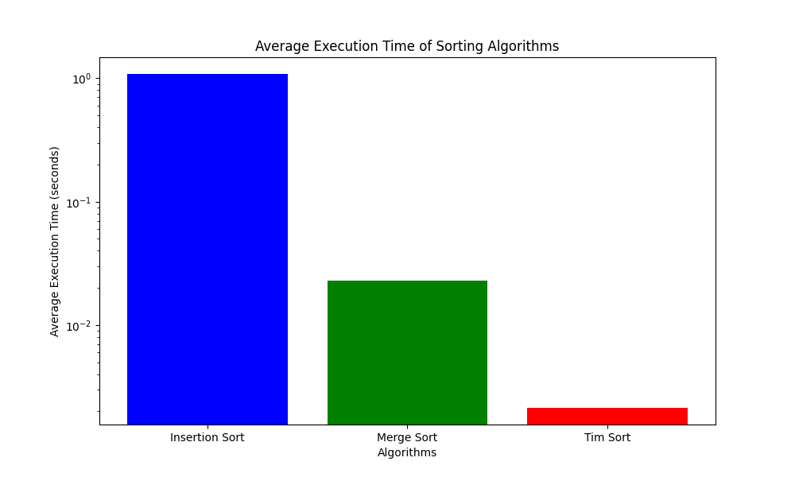

# goit-algo-hw-04

## Порівняння різних алгоритмів сортування

### Для порівняння були використанні 3 алгоритми сортування: Insertion, Merge, Timsort. Алгоритми були протестовані на наборі даних з 10000 випадково згенерованих чисел. З отриманих даних бачимо, що найбільш ефективний алгоритм - це Timsort. Наступний по ефективності - Merge, і останній - Insert.

